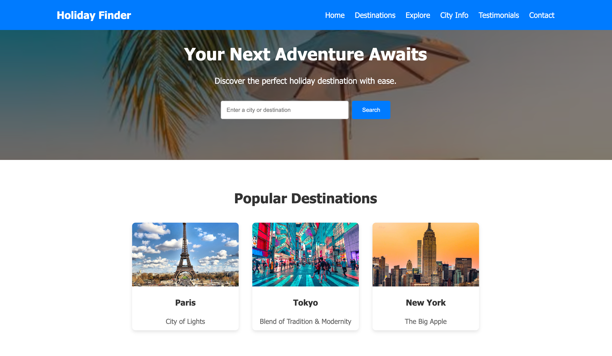
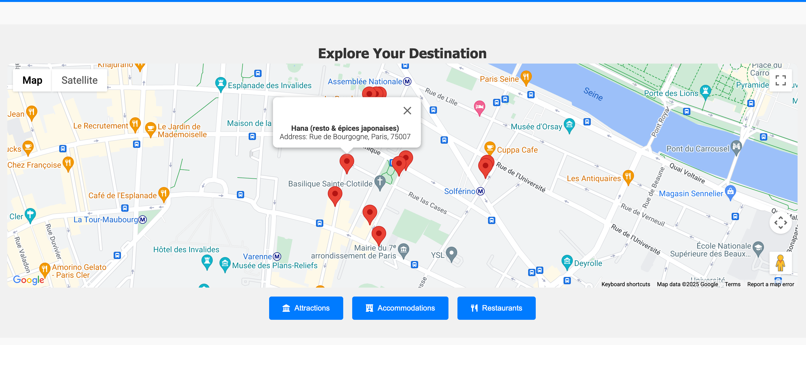
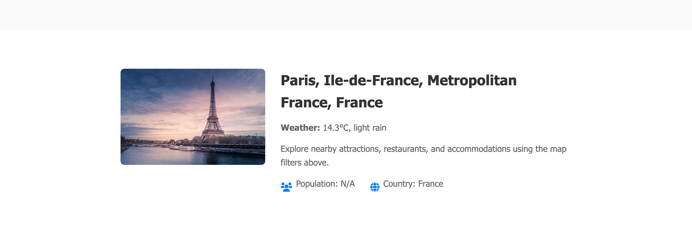

# Interactive Web Application: Holiday Destination Finder


## Table of Contents

1. [Introduction](#introduction)
2. [Purpose and Value](#purpose-and-value)
3. [Features](#features)
4. [Technologies Used](#technologies-used)
5. [Testing Procedures](#testing-procedures)
   - [Automated Testing](#automated-testing)
   - [Manual Testing](#manual-testing)
6. [Development Cycle](#development-cycle)
7. [Code Attribution](#code-attribution)
8. [License](#license)

---

## Introduction

The **Holiday Destination Finder** is an interactive web application designed to help users discover their next holiday destination. It integrates with multiple APIs to provide real-time information about cities, including weather, attractions, accommodations, and restaurants. The application features a responsive design, smooth navigation, and a modern user interface.

---

## Purpose and Value

### Purpose

The purpose of this application is to:

- Provide users with a seamless way to search for holiday destinations.
- Display detailed information about cities, including weather, population, and nearby attractions.
- Allow users to explore nearby accommodations and restaurants using an interactive map.

### Value to Users

- **Ease of Use**: Users can quickly search for cities and view relevant information in one place.
- **Real-Time Data**: The application integrates with APIs to provide up-to-date weather and location data.
- **Responsive Design**: The application works seamlessly on both desktop and mobile devices.
- **Interactive Map**: Users can explore nearby attractions, accommodations, and restaurants using the map.

---

## Features

- **Search for Cities**: Enter a city name to view its location on the map and get detailed information.
- **Explore Nearby Places**: Filter nearby attractions, accommodations, and restaurants using the map.
- **City Information**: Display city details, including weather, population, and country.
- **Responsive Design**: Optimized for both desktop and mobile devices.
- **Hamburger Menu**: Mobile-friendly navigation menu.
- **Smooth Scrolling**: Smooth transitions when navigating between sections.
- **Modern Loading Animation**: Rotating loader overlay during API requests.

---

## Technologies Used

- **Frontend**:
  - HTML5
  - CSS3 (Flexbox, Grid)
  - JavaScript (ES6+)
- **APIs**:
  - [Google Maps JavaScript API](https://developers.google.com/maps/documentation/javascript/overview)
  - [LocationIQ API](https://locationiq.com/) (Geocoding and Nearby Places)
  - [OpenWeatherMap API](https://openweathermap.org/api) (Weather Data)
  - [Unsplash API](https://unsplash.com/developers) (City Images)
- **Libraries**:
  - [Font Awesome](https://fontawesome.com/) (Icons)
- **Tools**:
  - Git (Version Control)
  - GitHub (Hosting)

---

## Testing Procedures

### Automated Testing

Automated testing involves using scripts and tools to test the application without manual intervention. It is ideal for repetitive tasks and regression testing.

#### When to Use Automated Testing:

- **Unit Testing**: Test individual components (e.g., JavaScript functions).
- **Integration Testing**: Ensure APIs and components work together.
- **Performance Testing**: Check the application's responsiveness under load.

#### Tools for Automated Testing:

- **Jest**: For unit testing JavaScript functions.
- **Cypress**: For end-to-end testing of the application.

#### Example of Automated Testing:

```javascript
// Example unit test for a JavaScript function
test("adds 1 + 2 to equal 3", () => {
  expect(sum(1, 2)).toBe(3);
});
```

### Manual Testing

Manual testing involves human testers interacting with the application to identify issues. It is ideal for usability and exploratory testing.

#### When to Use Manual Testing:

- **Usability Testing**: Ensure the application is user-friendly.
- **Exploratory Testing**: Identify unexpected issues.
- **Responsiveness Testing**: Verify the application works on different devices and screen sizes.

#### Steps for Manual Testing:

1. **Functionality Testing**:

   - Test the search functionality.
   - Verify the map displays the correct location.
   - Check if filters (attractions, accommodations, restaurants) work as expected.

2. **Usability Testing**:

   - Ensure the navigation menu is intuitive.
   - Verify the loading animation appears during API requests.

3. **Responsiveness Testing**:
   - Test the application on different devices (desktop, tablet, mobile).
   - Ensure the layout adjusts correctly for smaller screens.

---

## Development Cycle

### Version Control

The project uses Git for version control. Key milestones are documented through commit messages.

#### Example Commit Messages:

- `feat: Add search functionality for cities`
- `fix: Resolve issue with map markers not displaying`
- `docs: Update README with testing procedures`

### Deployment

The application is deployed using [GitHub Pages](https://pages.github.com/). The deployed version is tested to ensure it matches the development version.

---

## Code Attribution

### External Code

- **Google Maps JavaScript API**: Used for map integration.

  ```javascript
  // Google Maps API script
  <script
    src="https://maps.googleapis.com/maps/api/js?key=YOUR_API_KEY&callback=initMap"
    async
    defer
  ></script>
  ```

- **Font Awesome**: Used for icons.
  ```html
  <!-- Font Awesome CSS -->
  <link
    rel="stylesheet"
    href="https://cdnjs.cloudflare.com/ajax/libs/font-awesome/6.0.0/css/all.min.css"
  />
  ```

### Custom Code

All custom code is written by the developer and is located in the `scripts/main.js` and `styles/main.css` files.

---

## License

This project is licensed under the **MIT License**. See the [LICENSE](LICENSE) file for details.

---

## Screenshots

### User Story: Search for a City



### User Story: Explore Nearby Places



### User Story: View City Information



---

## Credits

For questions or feedback, feel free to reach out:

- **Developer**: Lloyd
- **GitHub**: https://github.com/Lloyd952